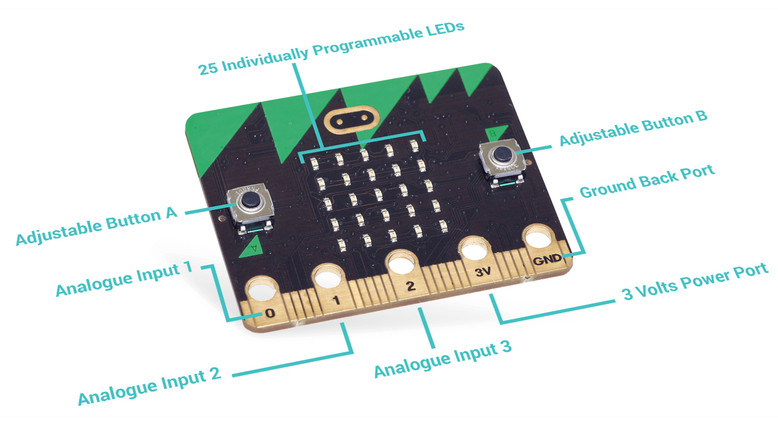

% Objets connectés
% en mathématiques, c’est possible !
% Colloque de Lyon - juin 2018

---
slideNumber: true
showNotes: false
---

# Présentations

## Animateurs d'atelier

#### Qui ?
Bruno Bourgine & Pascal Padilla

#### Quoi ?
Professeurs de Mathématiques et Sciences Physiques en Lycée Professionnel

#### Où ?
IREM Marseille

## Groupe InEFLP

Innovation

#### Formes scolaires innovantes

Expérimentation

#### Micro-contrôleur

Formation

####Algorithme

## À propos de cet atelier

#### Programmer des objets connectés pour faire des maths.

* Comprendre les objets de notre environnement.
* Des objets pour mesurer et communiquer.
* Des objets pour faire des maths.

## Déroulement de cet atelier
### (théorique)

1. Découverte du Micro:bit
2. La programmation par bloc
3. La programmation en Python

# Micro:Bit

## 

{width=65%}

<aside class="notes">
<ul>
<li>UMicro:bit est un microcontrôleur développé au Royaume-Unis.
<li>Par ses caractéristiques techniques et ses interfaces pédagogiques,
cet objet possède un fort potentiel pour l’enseignement de
l’algorithmique.
</ul>
</aside>

##

{width=40%}
{width=40%}

<aside class="notes">
<ul>
<li>Une carte à l'initiative de la BBC pour équiper
tous les collégiens anglais.
<li>Un petit objet robuste programmable par un enfant de 10 ans
<li>De grandes possibilités d'interactions avec l'environnement.
</ul>
</aside>

##

{width=45%}
{width=45%}

<aside class="notes">
La carte se programme
<ul>
<li>par bloc
<li>en Python
<li>en JavaScript
</ul>
</aside>

## {data-background-video="./res/mu.mp4" data-background-video-loop="true" data-background-size="contain"}

<aside class="notes">
La carte se programme
<ul>
<li>par bloc
<li>en Python
<li>en JavaScript
</ul>
</aside>

##

{width=55%}
{width=55%}

<aside class="notes">
entrées/sorties
<ul>
<li>bouton, broches,
<li>en radio/bluetooth
<li>en Javacompas, acceléromètre, température, luminosité
</ul>
</aside>

## Petit quizz ! 

<aside class="notes">
<a href="https://create.kahoot.it/details/atelier-lyon-quizz-1/ff6a8b84-cf7e-405d-a58a-d898a7f3ee03">
lien vers le Kahoot
</a>
</aside>

Ouvrir le lien utile **Quizz** de la page 

### [http://url.univ-irem.fr/n/](http://url.univ-irem.fr/n)

 
 
## À propos du tirage aléatoire

Discussion :

* quel intéret ?
* quelle plus-value ? 

<aside class="notes">
<ul>
<li>traitement rapide des résultats
<li>modélisation par l'élève pour tendre vers des activités plus complexes
<li>modélisation de situations complexes
</ul>
</aside>

# Programmation par blocs

## Makecode

<video loop data-autoplay src="./res/makecode.mp4" width="75%"></video>

* interface en ligne [https://makecode.microbit.org/](https://makecode.microbit.org/)
* programmation par bloc ou en javascript
* simulateur

## {data-background-video="./res/makecode-tuto.mp4" data-background-video-loop="true" data-background-size="contain"}

## Micro:Bit {data-background-video="./res/mu.mp4" data-background-video-loop="true" data-background-size="contain"}

### Comment ?

<aside class="notes">
<ul>
<li>interface en local *mu*
<li>programmation par Python
<li>grapheur
</ul>
</aside>

## Micro:Bit

### Diffusion

<iframe data-src="http://microbit.readthedocs.io/fr/latest/" width="100%" height="450px"></iframe>

# Liens utiles

## à noter 

* Programmation par blocs :
	* ``microbit code``
	* (ou [https://makecode.microbit.org/](https://makecode.microbit.org/))

* Programmation Python :
	* en ligne : [https://create.withcode.uk/](https://create.withcode.uk/)
	* hors ligne :

# Présentation du groupe

---
{data-background-image="./res/boss.jpg" data-background-size="contain" data-background-repeat="repeat"}
---

## groupe InEFLP
### Innovation Expérimentation et Formation en Lycée Professionnel

*  8 enseignants PLP Maths/Sciences (2017/2018)

## groupe InEFLP
###Centres d'intérêts du groupe

* Innovation
<h4 class="fragment fade-up">Formes scolaires innovantes</h4>
* Expérimentation
<h4 class="fragment fade-up">Micro-contrôleur</h4>
* Formation
<h4 class="fragment fade-up">Algorithme</h4>

# Formation   Algorithmique

---
{data-background-video="./res/boss.mp4" data-background-video-loop="true" data-background-size="contain"}
---

## Stage Algo

---
{data-background-image="./res/boss5.jpg" data-background-size="contain" }
---

* Stage mis en place par les IEN MSPC
* 2017-2018 :
	* 3×2 journées pour les PLP MSPC
	* 2×1 journée pour les PE enseignant en SEGPA
* Public hétérogène

<aside class="notes">
<ul>
<li>2016-2017 : formations (3PP, formateurs, PLP)</li>
<li>hétérogène pour diverses raisons (niveaux, stages précédents…)</li>
</ul>
</aside>

##
### Informatique branchée et débranchée
{width=45%}
{width=40%}

##
### Réflexion et travail par groupes
{width=45%}
{width=45%}

##  {data-background-video="./res/galton2_2.mp4" data-background-video-loop="true" data-background-size="contain"}

<h1 class="fragment current-visible">Micro:bit</h1>

# Expérimentation   Micro-contrôleur {data-background-video="./res/galton2_2.mp4" data-background-video-loop="true" data-background-size="contain"}

## Micro:Bit
### C'est quoi ?

Une carte à l'initiative de la BBC pour équiper tous les collégiens anglais.

Un petit objet robuste programmable par un enfant de 10 ans

De grandes possibilités d'interactions avec l'environnement.

## Micro:Bit
### Pour quoi faire ?

* aborder la partie algorithmique du cycle4 (3ème Prépa-Pro)
* initier les élèves à la programmation en AP
* réaliser des projets incluant un objet  programmable
* aborder des notions de mathématiques du programme de BAC Pro

## Micro:Bit

<video loop data-autoplay src="./res/makecode.mp4" width="75%"></video>

* interface en ligne [https://makecode.microbit.org/](https://makecode.microbit.org/)
* programmation par bloc ou en javascript
* simulateur

## Micro:Bit {data-background-video="./res/mu.mp4" data-background-video-loop="true" data-background-size="contain"}
### Comment ?

<aside class="notes">
<ul>
<li>interface en local *mu*</li>
<li>programmation par Python</li>
<li>grapheur
</ul>
</aside>

## Micro:Bit
### Diffusion

<iframe data-src="http://microbit.readthedocs.io/fr/latest/" width="100%" height="450px"></iframe>

## STMicroelectronics

STMicroelectronics est en train de développer sa
carte de prototypage pour l'éducation.

{width=45%}

<aside class="notes">
<ul>
<li>société d'origine France/Italie / commercialise des puces électroniques
 / un leader mondial du secteur de la prod. de semi-conducteurs</li>
<li>Algo LP <=> objets connectés / mesures physiques / objets concrets<li>
</ul>
</aside>

## STM32 Education

Partenariat avec l'académie d'Aix-Marseille :
*Promotion de l'électronique, du numérique et du codage*.

2017/2018 : 1ère phase de test en cours sur un prototype.

{width=40%}
{width=40%}
{width=10%}

## STM32 conseil

{width=100%}

# Merci
##Groupe InEFLP

<h4>Innovation</h4>
Formes scolaires innovantes

<h4>Expérimentation</h4>
Micro-contrôleur

<h4>Formation</h4>
Algorithme

<h4> Lycée Professionnel </h4>

<aside class="notes">
<ul>
<li>colloque de Lyon<li>
<li> covoiturage</li>
</ul>
</aside>
