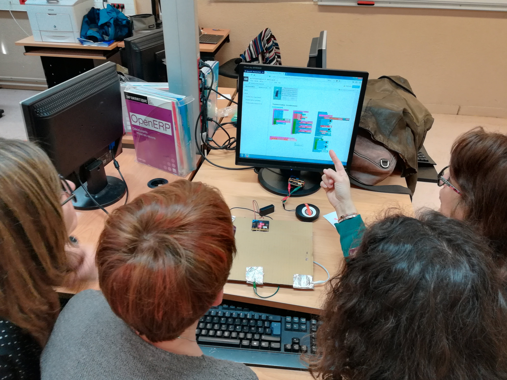
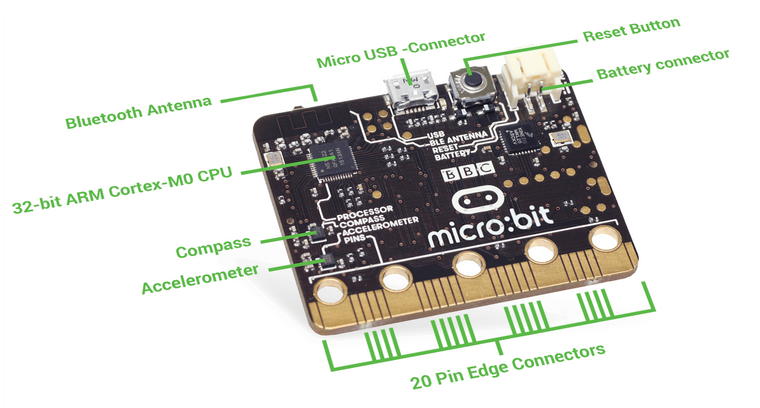

% TOTOLes objets connectés pour l’apprentissage de la programmation
% <br>Barcamp Code<br> Une journée autour de la programmation


---
slideNumber: true
showNotes: false
---


# Présentation


## Animateurs d'atelier

#### Qui ?
Bruno Bourgine & Pascal Padilla

#### Quoi ?
Professeurs de Mathématiques et Sciences Physiques en Lycée Professionnel

#### Où ?
IREM Marseille


## Groupe InEFLP


Innovation

#### Formes scolaires innovantes

Expérimentation

#### Micro-contrôleur

Formation

####Algorithme


## À propos de cet atelier

#### Programmer des objets connectés pour faire des maths.

* Comprendre les objets de notre environnement.
* Des objets pour mesurer et communiquer.
* Des objets pour faire des maths.

## Déroulement de cet atelier
### (théorique)

1. Découverte du Micro:bit
2. La programmation par bloc
3. La programmation en Python


# Micro:Bit

## 

{width=65%}

<aside class="notes">
<ul>
<li>UMicro:bit est un microcontrôleur développé au Royaume-Unis.
<li>Par ses caractéristiques techniques et ses interfaces pédagogiques,
cet objet possède un fort potentiel pour l’enseignement de
l’algorithmique.
</ul>
</aside>


##

{width=40%}
{width=40%}

<aside class="notes">
<ul>
<li>Une carte à l'initiative de la BBC pour équiper
tous les collégiens anglais.
<li>Un petit objet robuste programmable par un enfant de 10 ans
<li>De grandes possibilités d'interactions avec l'environnement.
</ul>
</aside>


##

{width=45%}
{width=45%}

<aside class="notes">
La carte se programme
<ul>
<li>par bloc
<li>en Python
<li>en JavaScript
</ul>
</aside>


## {data-background-video="./res/mu.mp4" data-background-video-loop="true" data-background-size="contain"}

<aside class="notes">
La carte se programme
<ul>
<li>par bloc
<li>en Python
<li>en JavaScript
</ul>
</aside>


##

{width=55%}
{width=55%}

<aside class="notes">
entrées/sorties
<ul>
<li>bouton, broches,
<li>en radio/bluetooth
<li>en Javacompas, acceléromètre, température, luminosité
</ul>
</aside>


## Petit quizz !


<aside class="notes">
<a href="https://create.kahoot.it/share/atelier-micro-bit-quizz-1/ff6a8b84-cf7e-405d-a58a-d898a7f3ee03">
lien vers le Kahoot
</a>
</aside>

Ouvrir le lien utile **Quizz** de la page 

**[http://url.univ-irem.fr/C/](http://url.univ-irem.fr/C)**
 
[](http://url.univ-irem.fr/C)
 
 
## À propos du tirage aléatoire

Discussion :

* quel intéret ?
* quelle plus-value ? 

<aside class="notes">
<ul>
<li>traitement rapide des résultats
<li>modélisation par l'élève pour tendre vers des activités plus complexes
<li>modélisation de situations complexes
</ul>
</aside>


# Programmation par blocs

## Makecode

<video loop data-autoplay src="./res/makecode.mp4" width="75%"></video>


* interface en ligne [https://makecode.microbit.org/](https://makecode.microbit.org/)
* programmation par bloc ou en javascript
* simulateur


## 


<video loop data-autoplay src="./res/makecode-tuto.mp4" width="75%"></video>


<aside class="notes">

Pour le Kahoot, ne pas oublier :
* 17 ans d'ancienneté !
* bloc aléa : "choisir au hasard"

</aside>


**[http://url.univ-irem.fr/C/](http://url.univ-irem.fr/C)**

{width=5%}

 
 

## Petit quizz ! 


<aside class="notes">
<a href="https://create.kahoot.it/share/atelier-micro-bit-quizz-2/a1d7fe7e-3f7e-4837-b3e1-fd77dd71f3bc">
lien vers le Kahoot
</a>
</aside>

Ouvrir le lien utile **Quizz** de la page 

**[http://url.univ-irem.fr/C/](http://url.univ-irem.fr/C)**

[](http://url.univ-irem.fr/C)


# Programmation Python

##

{width=100%}


[http://url.univ-irem.fr/C/](http://url.univ-irem.fr/C)

{width=5%}


## Afficher un texte

```python
from microbit import *
display.scroll("Hello,")
display.show("World!")
```


## Terminal et sortie graphique

```python
from microbit import *
import random
nb1 = 0
total = 0
for i in range(1000):
    tirage = random.randint(0,1)
    total = total + 1
    nb1 = nb1 + tirage
    nb0 = total - nb1
    print((i, nb1/total, nb0/total))
```

## Des images

```python
from microbit import *
display.show(Image.HAPPY)
sleep(1000)
display.show(Image.ANGRY)
sleep(1000)
display.clear()
```


## Les boutons

```python
from microbit import *
sleep(10000)
display.scroll(str(button_a.get_presses()))
```


## Le mouvement

```python
from microbit import *
while True:
	capteur = accelerometer.get_x()
	if capteur > 40:
		display.show(Image.ARROW_E)
	elif capteur < -40:
		display.show(Image.ARROW_W)
	else:
		display.show("-")
```


## Les gestes

```python
from microbit import *
import random
button_b.was_pressed()
while True:
    display.show("8")
    if accelerometer.was_gesture("shake"):
        display.clear()
        sleep(1000)
        display.scroll(random.choice(["Oui","Non"]))
    if button_b.was_pressed():
    	display.clear()
        break
```


## La radio

```python
from microbit import *
import radio
import random
while True:
    if button_a.was_pressed():
        radio.send("A")
    if button_b.was_pressed():
        radio.send("B")
    # récepteur
    incomming = radio.receive()
    if incomming == "A":
        display.scroll("A")
    if incomming == "B":
        display.scroll("B")
    sleep(20)

```


## Petit quizz ! 


<aside class="notes">
<a href="https://create.kahoot.it/share/atelier-micro-bit-quizz-3/5fd65425-a0e9-4182-8b09-8359a4504c3e">
lien vers le Kahoot
</a>
</aside>

Ouvrir le lien utile **Quizz** de la page 

### [http://url.univ-irem.fr/C/](http://url.univ-irem.fr/C)

[](http://url.univ-irem.fr/C)


# Activité de recherche

## Problématique

On utilise une boucle de *n* itérations pour
allumer aléatoirement les diodes du Micro:bit.

{width=20%}


#### Combien d'itérations sont nécessaires pour allumer toutes les diodes ?


# Merci
##Groupe InEFLP

<span class="fragment fade-down">
<h4>Innovation</h4>
Formes scolaires innovantes

<h4>Expérimentation</h4>
Micro-contrôleur

<h4>Formation</h4>
Algorithme

<h4> Lycée Professionnel </h4>
</span>

<aside class="notes">
<ul>
<li>colloque de Lyon<li>
<li> covoiturage</li>
</ul>
</aside>
