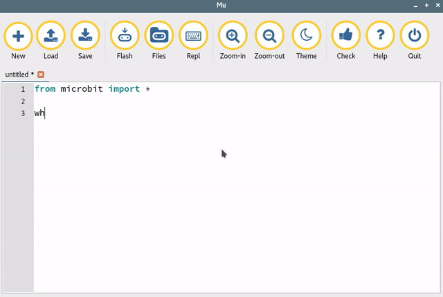

Micro:Bit 


un objet programmable pour faire des maths

{width=65%}

---


# Présentations

--


## Animateurs d'atelier

#### Qui ?
Bruno Bourgine & Pascal Padilla

#### Quoi ?
Professeurs de Mathématiques et Sciences Physiques en Lycée Professionnel

#### Où ?
IREM Marseille


--

## Groupe InEFLP


Innovation

#### Formes scolaires innovantes

Expérimentation

#### Micro-contrôleur

Formation

#### Algorithme


---


## À propos de cet atelier

#### Programmer des objets connectés pour faire des maths.

* Comprendre les objets de notre environnement.
* Des objets pour mesurer et communiquer.
* Des objets pour faire des maths.

--

## Déroulement de cet atelier
  
### (théorique)

1. Découverte du Micro:bit {.fragment .fade-down}
2. La programmation par bloc {.fragment .fade-down}
3. La programmation en Python {.fragment .fade-down}

---

# Découvrons le Micro:Bit

--


{width=40%}
{width=40%}


<aside class="notes">
<ul>
<li>Une carte à l'initiative de la BBC pour équiper
tous les collégiens anglais.
<li>Un petit objet robuste programmable par un enfant de 10 ans
<li>De grandes possibilités d'interactions avec l'environnement.
</ul>
</aside>


--

## Activité de découverte

{width=40%}

* Mais qu'est-ce que ça fait ?{.fragment .fade-down}
 
* Est-ce que c'est équiprobable ?{.fragment .fade-down}


--


## Équipement de série ..

{width=45%} {width=45%}

<aside class="notes">
entrées/sorties
<ul>
<li>bouton, broches,
<li>radio/bluetooth
<li>compas, acceléromètre, température, luminosité
</ul>
</aside>


--


## Programmation ...

  #### ...avec des blocs (Makecode, Blockly)
  
  {width=40%} {width=40%}
  

<aside class="notes">
La carte se programme
<ul>
<li>par bloc
<li>en Python
<li>en JavaScript
</ul>
</aside>

--


## Programmation ...

  #### ...avec du code (Javascript, Python, C/C++)
  {width=40%} {width=40%}


--

## Petit quizz ! 

{width=55%}


[https://kahoot.it](http://kahoot.it)

<aside class="notes">
<a href="https://play.kahoot.it/v2/?quizId=127ce299-839e-4715-bd85-d8ebc251209d">
lien vers le Kahoot
</a>
</aside>


--


 
## À propos du tirage aléatoire


### Discussion :

* quel intéret ?
* quelle plus-value ? 

<aside class="notes">
<ul>
<li>traitement rapide des résultats
<li>modélisation par l'élève pour tendre vers des activités plus complexes
<li>modélisation de situations complexes
</ul>
</aside>


---


# Programmation par blocs


--

### Makecode

<video loop data-autoplay src="./res/makecode.mp4" width="75%"></video>


* interface en ligne [https://makecode.microbit.org/](https://makecode.microbit.org/)
* programmation par bloc ou en javascript
* simulateur


--

### Makecode


<video loop data-autoplay src="./res/makecode-tuto.mp4" width="75%"></video>

[https://cutt.ly/staosBy](https://cutt.ly/staosBy)

--

## Exemples d'activités ...

[https://cutt.ly/staosBy](https://cutt.ly/staosBy)

- [Fractions](https://github.com/iremlp/brochure-IREM---microbit/blob/master/fiches/fiche_mb-fraction.tex.pdf)
- Pile ou Face
- Dé
- Fluctuation d'échantillonnage

<aside class="notes">
<ul>
<li>cycle 4 / lycée
<li>chrome à privilégier pour webUSB
<li>lecture série
</ul>
</aside>
 

---


# Programmation Python


--

## mu-editor

{width=80%}


[https://cutt.ly/staosBy](https://cutt.ly/staosBy)


--


## Afficher un texte

```python
from microbit import *
display.scroll("Hello,")
display.show("World!")
```

--


## Terminal et sortie graphique

```python
from microbit import *
import random
nb1 = 0
total = 0
for i in range(1000):
    tirage = random.randint(0,1)
    total = total + 1
    nb1 = nb1 + tirage
    nb0 = total - nb1
    print((i, nb1/total, nb0/total))
```

--

## Des images

```python
from microbit import *
display.show(Image.HAPPY)
sleep(1000)
display.show(Image.ANGRY)
sleep(1000)
display.clear()
```

--


## Les boutons

```python
from microbit import *
sleep(10000)
display.scroll(str(button_a.get_presses()))
```

--


## Le mouvement

```python
from microbit import *
while True:
	capteur = accelerometer.get_x()
	if capteur > 40:
		display.show(Image.ARROW_E)
	elif capteur < -40:
		display.show(Image.ARROW_W)
	else:
		display.show("-")
```

--


## Les gestes

```python
from microbit import *
import random
button_b.was_pressed()
while True:
    display.show("8")
    if accelerometer.was_gesture("shake"):
        display.clear()
        sleep(1000)
        display.scroll(random.choice(["Oui","Non"]))
    if button_b.was_pressed():
    	display.clear()
        break
```

--


## La radio

```python
from microbit import *
import radio
import random
while True:
    if button_a.was_pressed():
        radio.send("A")
    if button_b.was_pressed():
        radio.send("B")
    # récepteur
    incomming = radio.receive()
    if incomming == "A":
        display.scroll("A")
    if incomming == "B":
        display.scroll("B")
    sleep(20)

```


---


## Petit quizz ! 


{width=55%}


[https://kahoot.it](http://kahoot.it)

<aside class="notes">
<a href="https://play.kahoot.it/v2/?quizId=39707329-6c08-42ec-900e-f30e772ecda5">
lien vers le Kahoot
</a>
</aside>


---

# Pour aller plus loin

--

# Augmenter votre micro:bit !

- Kit d'extension : ajouter des capteurs et des interfaces
- Scratch : faire interagir micro:bit et Scratch c'est facile!
- Vittascience : passer facilement du bloc à python, et utiliser micro:bit pour des projets scientifiques (ballon solaire)


--

# Classroom

- Partager du code
- Superviser les travaux des élèves
- Sauvergarder des sessions de travail

--

... Rendez-vous à la

5ème journée sur
l’enseignement de l’informatique

mercredi 25 mars

(Luminy)...


---


# Activité de recherche

--

## Problématique

On utilise une boucle de *n* itérations pour
allumer aléatoirement les diodes du Micro:bit.

{width=30%}


--

### Combien d'itérations sont nécessaires pour allumer toutes les diodes ?


---


# Merci

## Groupe InEFLP

<span class="fragment fade-down">
<h4>Innovation</h4>
Formes scolaires innovantes

<h4>Expérimentation</h4>
Micro-contrôleur

<h4>Formation</h4>
Algorithme

<h4> Lycée Professionnel </h4>
</span>

<aside class="notes">
<ul>
<li>colloque de Lyon<li>
<li> covoiturage</li>
</ul>
</aside>
