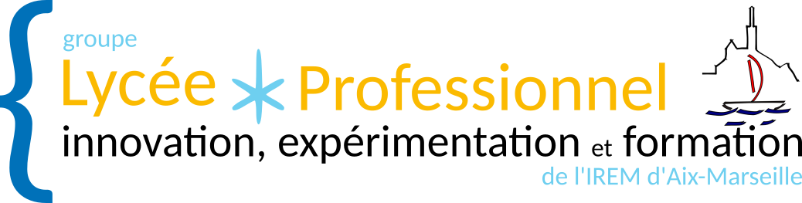

Nous sommes des enseignants de maths/sciences regroupés au sein
d’un groupe de recherche de l”IREM de Marseille.
Notre groupe de travail **Innovation, Expérimentation et Formation
en Lycée Professionnel** travaille sur les problématiques suivantes :

* enseignement innovant
* enseignement de l'algorithme en lycée professionnel

**Présentations et articles en lignes**

* 2018 [Présentation 06/2018 lors de l'AG de fin d'année de l'IREM](./2018_ag/)
* 2018 [Atelier colloque de Lyon](./2018_colloqueLyon/)
* 2017 [Article descriptif de Micro:bit](http://url.univ-irem.fr/ineflp-microbit)

Pour nous contacter, vous pouvez écrire au responsable actuel du groupe
[Pascal Padilla](mailto://irem.p@dilla.fr?subject=ContactGithub)

**Liens utiles**

* [Site académique de l'IREM d'Aix-Marseille](http://url.univ-irem.fr/mars)
* [Portail des IREM](http://www.univ-irem.fr/)
* [Site AMU du groupe InEFLP](https://irem.univ-amu.fr/fr/groupes-travail/groupe-travail-innovation-experimentation-formation-lp)

|Membres (2018-19)            |
|-----------------------------|
| Amourette	Sylvie            |
| Aubert	Barbara             |
| Bocheron	Jean-Philippe     |
| Bourgine	Bruno             |
| Duchesne	Stéphanie         |
| Ferrero	Sylvain             |
| Foureson	Fabienne          |
| Franchet	Lionel            |
| Grimal	François            |
| Mestas	Frank               |
| Mezard	Christophe          |
| Padilla	Pascal              |
| Petrovich	Doris             |
| Poussou	Jérome              |
| Rakotobe	Arilanto          |
| Roussel	Didier              |
| Simao	Stéphanie             |
