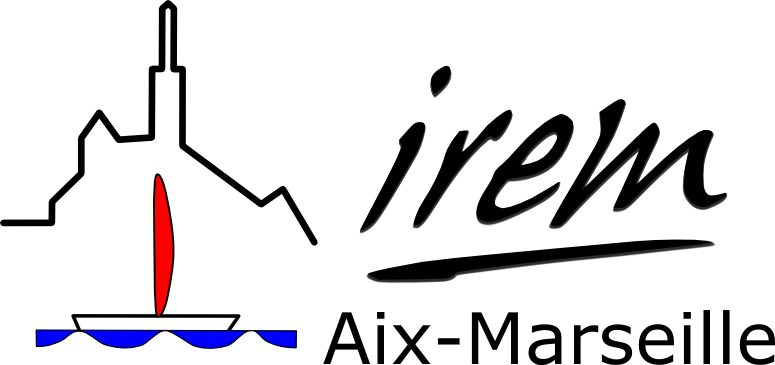

Nous sommes des enseignants de maths/sciences regroupés au sein
d’un groupe de recherche de l”IREM de Marseille.
Notre groupe de travail **Innovation, Expérimentation et Formation
en Lycée Professionnel** travaille sur les problématiques suivantes :

* enseignement innovant
* enseignement de l'algorithme en lycée professionnel

Vous trouverez ici nos présentations en ligne.

* [Présentation 06/2018 lors de l'AG de l'IREM](./2018_ag/)
* [Atelier colloque de Lyon](./2018_colloqueLyon/)

Pour nous contacter, vous pouvez écrire au responsable actuel du groupe
[Pascal Padilla](mailto://irem.p@dilla.fr?subject=ContactGithub)

