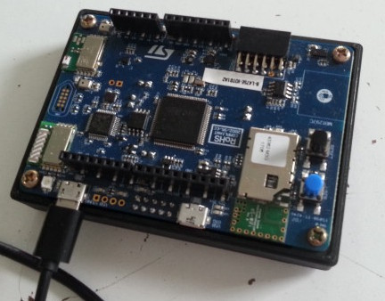
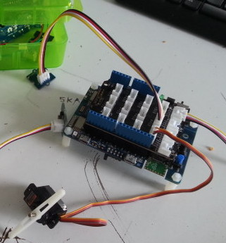
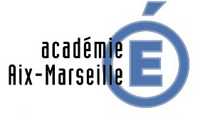
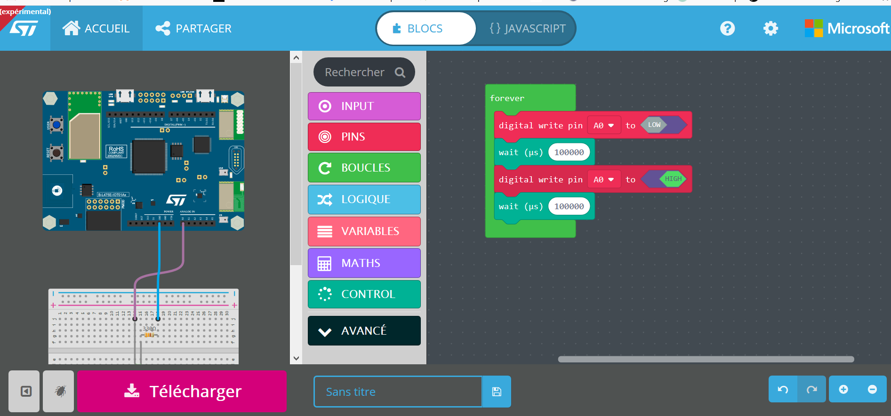

% Groupe InEFLP
% Innovation Expérimentation et Formation en Lycée Professionnel
% Thèmes de travail, année 2017/2018

---
slideNumber: true
showNotes: false
---

# Présentation du groupe 

---
{data-background-image="./res/boss.jpg" data-background-size="contain" data-background-repeat="repeat"}
---

## groupe InEFLP
### Innovation Expérimentation et Formation en Lycée Professionnel

*  8 enseignants PLP Maths/Sciences (2017/2018)

## groupe InEFLP
###Centres d'intérêts du groupe

* Innovation
<h4 class="fragment fade-up">Formes scolaires innovantes</h4>
* Expérimentation
<h4 class="fragment fade-up">Micro-contrôleur</h4>
* Formation
<h4 class="fragment fade-up">Algorithme</h4>

# Innovation   Formes scolaires

---
{data-background-image="./res/boss2.jpg" data-background-size="contain" data-background-repeat="repeat"}
---

## Moodle

<h1 class="fragment fade-up">C'est quoi ?</h1>

- plateforme d'apprentissage en ligne *LMS*
- depuis 2002
- équivalent à *Chamilo*, *Claroline*, *M@gistère*, *Dokeos*, *Wims*, etc.

## Moodle

<h1 class="fragment fade-up">Ça sert à quoi ?</h1>

* **diffuser** du contenu
* **suivre** l'activité des élèves
* **récupérer** des productions
* **automatiser** certaines tâches comme la notation ou le feedback

## Moodle {data-background-color="#bb1111"}

<h3 class="fragment fade-up"> Quoi de nouveau alors ?</h3>

- intégration à l'ENT académique Atrium
- parc informatique : PC & tablettes
- accès à internet pour tous
	* en classe
	* hors classe

## S'approprier Moodle

<video data-autoplay src="./res/moodle.mp4" width="80%"></video>

* prise en main depuis septembre 2017
* création de ressources

<aside class="notes">
Ressources :
<ul>
<li>vidéos (cours, méthode ou TP sciences)</li>
<li>exercices dont certains **automatisé avec GeoGebra**</li>
</ul>
</aside>

## Analyser Moodle
### Utile

* point d'entré unique pour diffuser et suivre l'activité
* élèves en activités, mobilisés, concentrés
* évaluations formatives
* intégration de médias variés
* accès hors temps scolaire

<aside class="notes">
<ul>
<li>outil info capte l'attention</li>
<li>gamification avec les Badges</li>
</ul>
</aside>

## Analyser Moodle
### Utilisable

* contraintes matérielles fortes
	- parc informatique entièrement fonctionnel
	- accès internet pour les élèves dans toutes les salles
* chronophage en amont
* outil riche et donc complexe

## Diffuser Moodle
###[http://url.univ-irem.fr/moodle](http://url.univ-irem.fr/moodle)

<iframe data-src="https://iremlp.readthedocs.io/fr/latest/index.html" width="100%" height="450px"></iframe>

## Moodle - Perspectives

Intégration de nouveaux membres :

* 2 enseignantes travaillant sur Chamilo
	* réalisation et mutualisation de ressources (vidéos)
	* recherche d'une structure, d'une organisation pertinente des activités/ressources
* 1 enseignante travaillant sur les compétences
	* moodle et les 5 compétences en maths/sciences
* 2 enseignantes travaillant sur le travail par groupe
	* articulation individus/numérique vs. groupes/îlots

# Formation   Algorithmique
 
---
{data-background-video="./res/boss.mp4" data-background-video-loop="true" data-background-size="contain"}
---

## Stage Algo

---
{data-background-image="./res/boss5.jpg" data-background-size="contain" }
---

* Stage mis en place par les IEN MSPC
* 2017-2018 :
	* 3×2 journées pour les PLP MSPC
	* 2×1 journée pour les PE enseignant en SEGPA
* Public hétérogène

<aside class="notes">
<ul>
<li>2016-2017 : formations (3PP, formateurs, PLP)</li>
<li>hétérogène pour diverses raisons (niveaux, stages précédents…)</li>
</ul>
</aside>

##
### Informatique branchée et débranchée
{width=45%}
{width=40%}

##
### Réflexion et travail par groupes
{width=45%}
{width=45%}

##
### De la programmation par blocs
{width=45%}
{width=45%}

##
### Des stagiaires perplexes
{width=45%}
{width=45%}

##
### Des objets connectés

{width=40%}
{width=40%}

##  {data-background-video="./res/galton2_2.mp4" data-background-video-loop="true" data-background-size="contain"}

<h1 class="fragment current-visible">Micro:bit</h1>

# Expérimentation   Micro-contrôleur {data-background-video="./res/galton2_2.mp4" data-background-video-loop="true" data-background-size="contain"}

## Micro:Bit
### C'est quoi ?

Une carte à l'initiative de la BBC pour équiper tous les collégiens anglais.

Un petit objet robuste programmable par un enfant de 10 ans

De grandes possibilités d'interactions avec l'environnement.

## Micro:Bit
### Pour quoi faire ?

* aborder la partie algorithmique du cycle4 (3ème Prépa-Pro)
* initier les élèves à la programmation en AP
* réaliser des projets incluant un objet  programmable
* aborder des notions de mathématiques du programme de BAC Pro

## Micro:Bit 

<video loop data-autoplay src="./res/makecode.mp4" width="75%"></video>

* interface en ligne [https://makecode.microbit.org/](https://makecode.microbit.org/)
* programmation par bloc ou en javascript
* simulateur

## Micro:Bit {data-background-video="./res/mu.mp4" data-background-video-loop="true" data-background-size="contain"}
### Comment ?

<aside class="notes">
<ul>
<li>interface en local *mu*
<li>programmation par Python
<li>grapheur
</ul>
</aside>

## STMicroelectronics

STMicroelectronics est en train de développer sa
carte de prototypage pour l'éducation.

{width=45%}

<aside class="notes">
<ul>
<li>société d'origine France/Italie / commercialise des puces électroniques
 / un leader mondial du secteur de la prod. de semi-conducteurs</li>
<li>Algo LP <=> objets connectés / mesures physiques / objets concrets<li>
</ul>
</aside>

## STM32 Education

Partenariat avec l'académie d'Aix-Marseille :
*Promotion de l'électronique, du numérique et du codage*.

2017/2018 : 1ère phase de test en cours sur un prototype. 

{width=40%}
{width=40%}
{width=10%}

## STM32 conseil

{width=100%}

# Merci
##Groupe InEFLP

<h4>Innovation</h4>
Formes scolaires innovantes

<h4>Expérimentation</h4>
Micro-contrôleur

<h4>Formation</h4>
Algorithme

<h4> Lycée Professionnel</h4>

