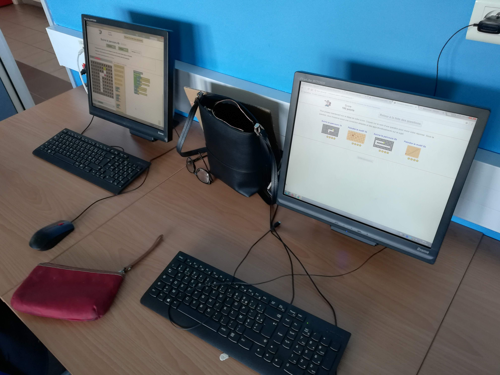
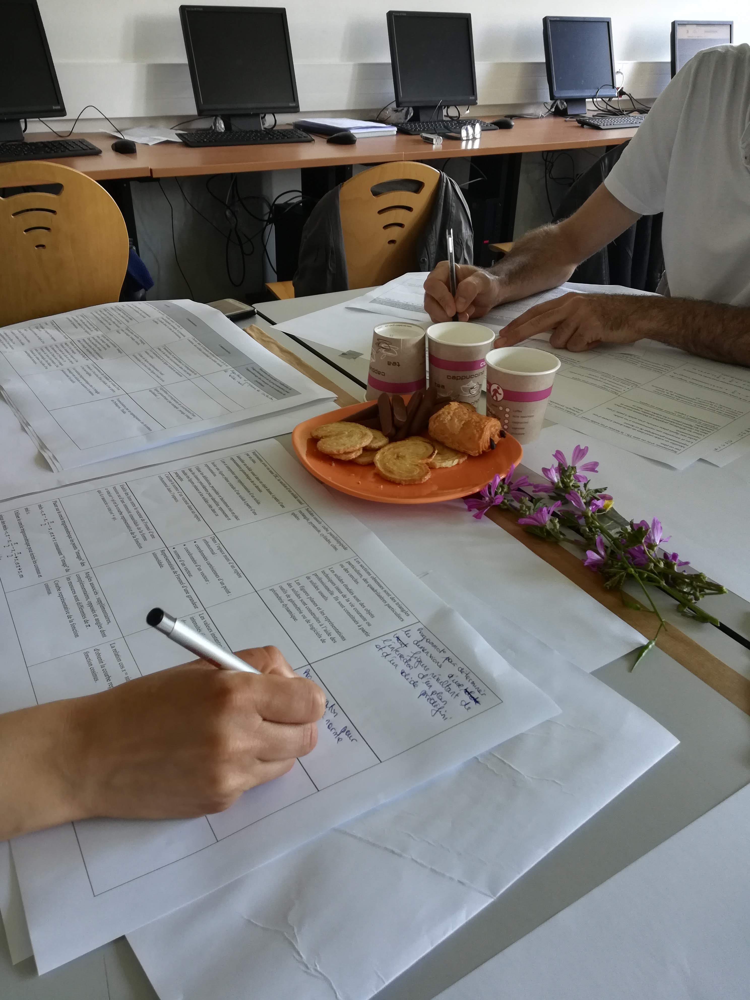
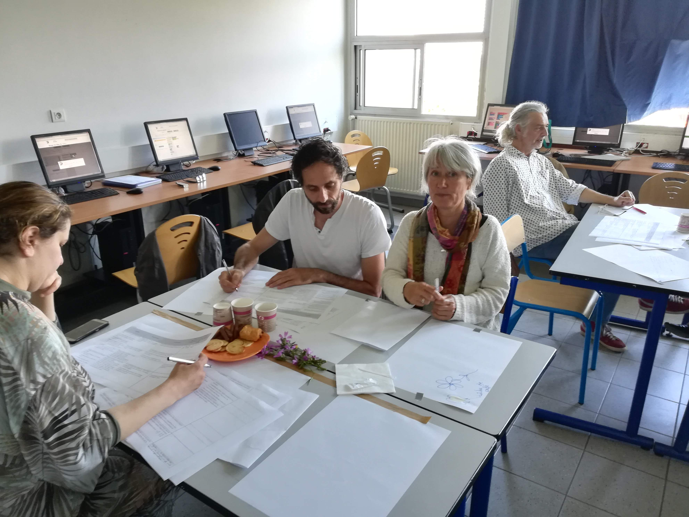
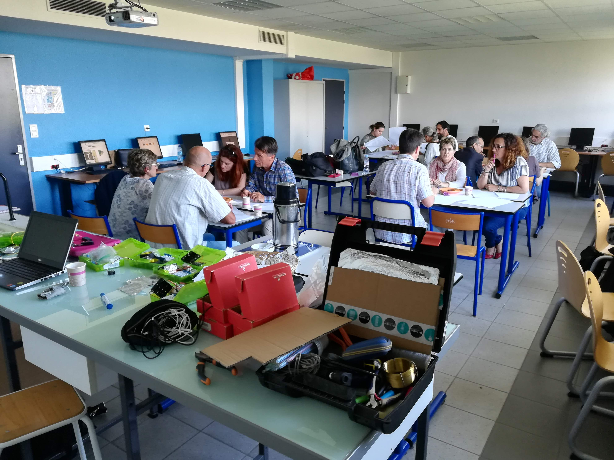
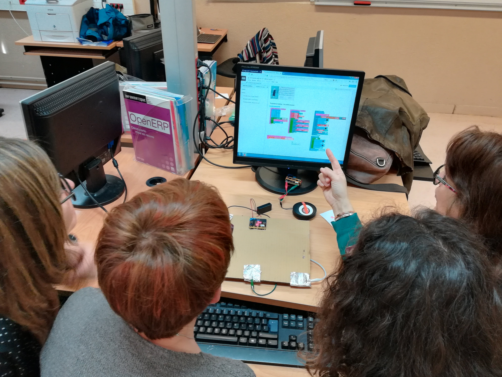
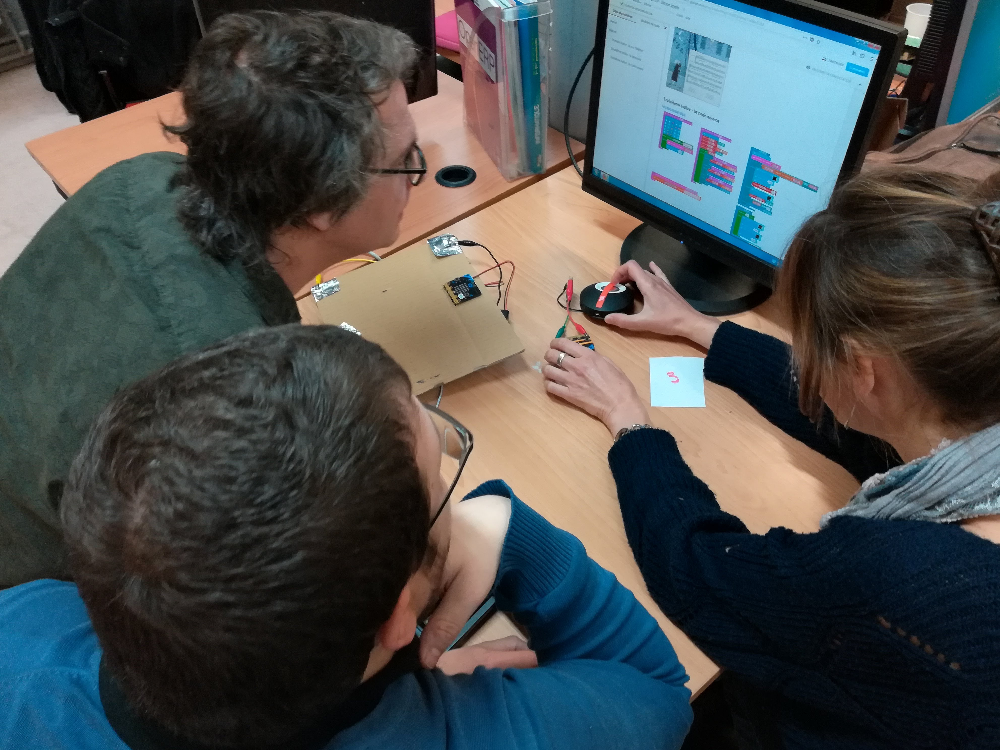
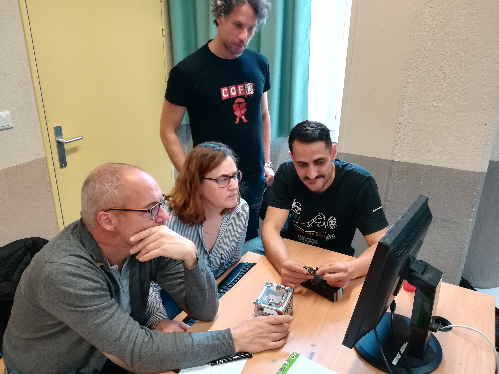
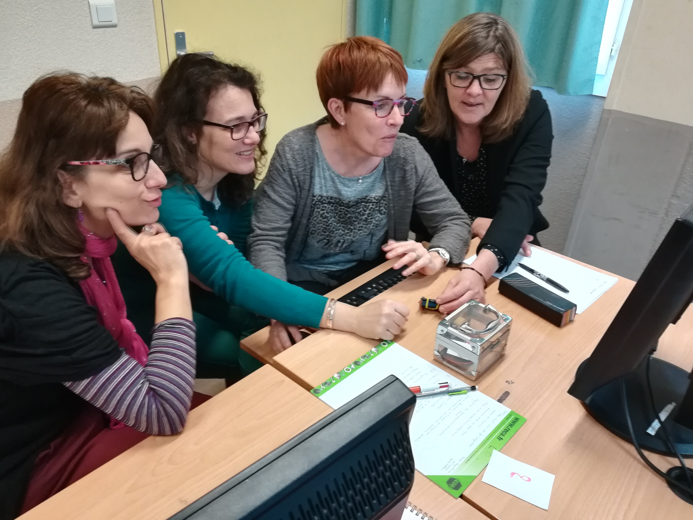
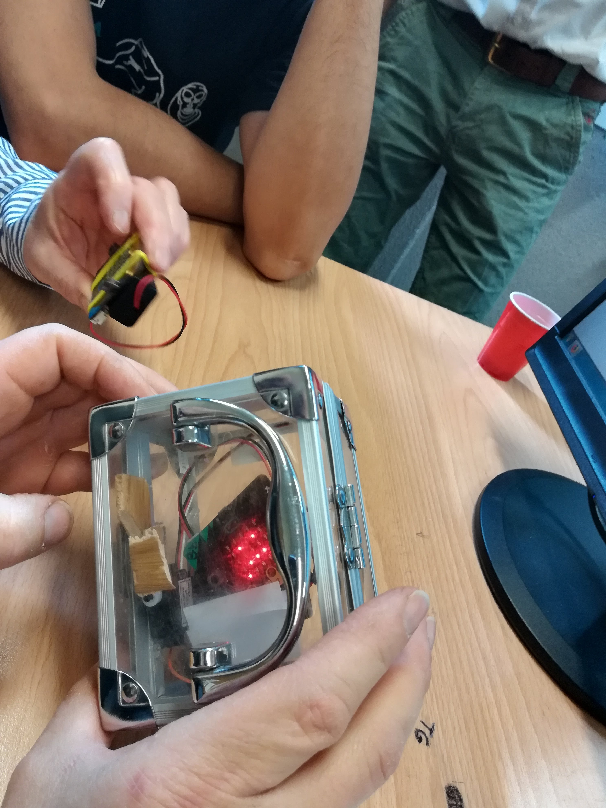
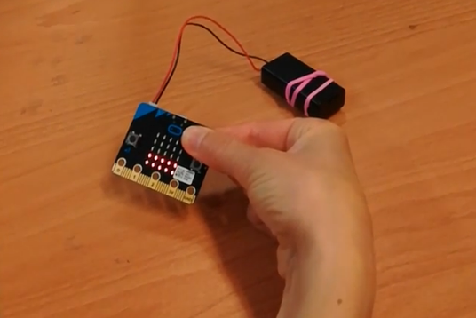

% Groupe InEFLP
% Innovation Expérimentation et Formation en Lycée Professionnel
% Thèmes de travail, année 2017/2018

---
slideNumber: true
showNotes: false
---

# Présentation du groupe {data-background-image="./res/boss.jpg" data-background-size="contain" data-background-repeat="repeat"}

## groupe InEFLP

* *InEFLP* : **In**novation, **E**xpérimentation
et **F**ormation en **L**ycée **P**rofessionnel.
* 8 enseignants PLP Maths/Sciences (2017/2018)

## groupe InEFLP - Centres d'intérêts du groupe

* **Thème 1** - Formes scolaires innovantes
* **Thème 2** - Algorithme
* **Thème 3** - Micro-contrôleur

# Formes scolaires innovantes {data-background-image="./res/boss2.jpg" data-background-size="contain" data-background-repeat="repeat"}

## Moodle

<h1 class="fragment fade-up">C'est quoi ?</h1>

- plateforme d'apprentissage en ligne *LMS*
- depuis 2002
- équivalent à *Chamilo*, *Claroline*, *M@gistère*, *Dokeos*, *Wims*, etc.

## Moodle

<h1 class="fragment fade-up">Ça sert à quoi ?</h1>

* **diffuser** du contenu
* **suivre** l'activité des élèves
* **récupérer** des productions
* **automatiser** certaines tâches comme la notation ou le feedback

## Moodle {data-background-color="#bb1111"}

<h3 class="fragment fade-up"> Quoi de nouveau alors ?</h3>

- intégration à l'ENT académique Atrium
- parc informatique : PC & tablettes
- accès à internet pour tous
	* en classe
	* hors classe

## Moodle - Appropriation

<video data-autoplay src="./res/moodle.mp4" width="80%"></video>

* prise en main depuis septembre 2017
* création de ressources

<aside class="notes">
Ressources :

vidéos (cours, méthode ou TP sciences)
exercices dont certains **automatisé avec GeoGebra**
</aside>

## Moodle - Analyse
### Utile

* point d'entré unique pour diffuser et suivre l'activité
* élèves en activités, mobilisé, concentré
* évaluations formatives
* intégration de médias variés
* accès hors temps scolaire

<aside class="notes">
outil info capte l'attention
gamification avec les Badges
</aside>

## Moodle - Analyse
### Utilisable

* contraintes matérielles fortes
	- parc informatique entièrement fonctionnel
	- accès internet pour tous
* chronophage en amont
* outil riche et donc complexe

## Moodle - Diffusion
###[http://url.univ-irem.fr/moodle](http://url.univ-irem.fr/moodle)

<iframe data-src="https://iremlp.readthedocs.io/fr/latest/index.html" width="100%" height="450px"></iframe>

## Moodle - Perspectives

Intégration de nouveaux membres :

* 2 enseignantes travaillant sur Chamilo
	* réalisation et mutualisation de ressources (vidéos)
	* recherche d'une structure, d'une organisation pertinente des activités/ressources
* 1 enseignante travaillant sur les compétences
	* moodle et les 5 compétences en maths/sciences
* 2 enseignantes travaillant sur le travail par groupe
	* articulation individus/numérique vs. groupes/îlots

# Algorithmique {data-background-video="./res/boss.mp4" data-background-video-loop="true" data-background-size="contain"}

## Stage Algo

---
{data-background-image="./res/boss5.jpg" data-background-size="contain" }
---

* Stage mis en place par les IEN MSPC
* 2017-2018 :
	* 3×2 journées pour les PLP MSPC
	* 2×1 journée pour les PE enseignant en SEGPA

<aside class="notes">
2016-2017 : formations:

3PP
formateurs
PLP
</aside>

##
### Informatique branchée et débranchée
{width=45%}
{width=40%}

##
### Réflexion et travail par groupes
{width=45%}
{width=45%}

##
### De la programmation par blocs
{width=45%}
{width=45%}

##
### Des stagiaires perplexes
{width=45%}
{width=45%}

##
### Des objets connectés

{width=40%}
{width=40%}

##  {data-background-video="./res/galton2_2.mp4" data-background-video-loop="true" data-background-size="contain"}

<h1 class="fragment current-visible">Micro:bit</h1>

# Micro-contrôleur {data-background-video="./res/galton2_2.mp4" data-background-video-loop="true" data-background-size="contain"}

## Micro:Bit
### C'est quoi ?

Une carte à l'initiative de la BBC pour équiper
tous les collégiens anglais.

Un petit objet robuste programmable
par un enfant de 10 ans

De grandes possibilités d'interactions
avec l'environnement.

## Micro:Bit
### Pour quoi faire ?

* aborder la partie algorithmique du cycle4 (3ème Prépa-Pro)
* initier les élèves à la programmation en AP
* réaliser des projets incluant un objet  programmable
* aborder des notions de mathématiques du programme de BAC Pro

## Micro:Bit
### Comment ?

## STM32

# à effacer plus tard…

## diapo 3

<iframe data-src="https://photos.google.com/share/AF1QipO_6d8crrdLVdzmyC50kZvGWz74xf0RKV2IVrVgyJIO1RWEZnvf27_QQhzS8qIDkQ/photo/AF1QipOSWDzUhDyPmvUbV8Stug84MymvrOBHrsUO85jU?key=WFpvbzhDRHBMQy1PRUc5OGhNT2JmYjFKbFVfaEFB"></iframe>

## Diapo 3.0

faire un clic droit juste en bas et la vidéo va se lancer…

<aside class="notes">
Oh hey, these are some notes. They'll be hidden in your presentation, but you can see them if you open the speaker notes window (hit »S« on your keyboard).
</aside>

<video class="stretch" src="http://clips.vorwaerts-gmbh.de/big_buck_bunny.mp4"></video>

## Diapo 3.1

<video data-autoplay src="http://clips.vorwaerts-gmbh.de/big_buck_bunny.mp4"></video>

Une image

{width=100%}

## Diapo 3.2 {data-background-video="https://s3.amazonaws.com/static.slid.es/site/homepage/v1/homepage-video-editor.mp4,https://s3.amazonaws.com/static.slid.es/site/homepage/v1/homepage-video-editor.webm"}

Encore une image:

## test fragments

	I'll fade in, then out

Appears last

Appears first

Appears second

grow

shrink

fade-out

fade-up (also down, left and right!)

visible only once

visible only once

visible only once

blue only once

highlight-red

highlight-green

highlight-blue

