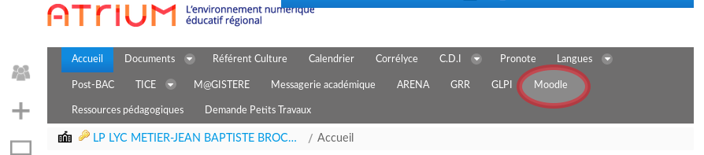

% Groupe InEFLP
% Innovation Expérimentation et Formation en Lycée Professionnel
% Thèmes de travail, année 2017/2018

---
slideNumber: true
showNotes: false
---

# Présentation du groupe {data-background-image="./res/boss.jpg" data-background-size="contain" data-background-repeat="repeat"}

## groupe InEFLP 

* *InEFLP* : **In**novation, **E**xpérimentation 
et **F**ormation en **L**ycée **P**rofessionnel.
* 8 enseignants PLP Maths/Sciences

## groupe InEFLP - Centres d'intérêts du groupe

* **Thème 1** - Formes scolaires innovantes
* **Thème 2** - Algorithme
* **Thème 3** - Micro-contrôleur

# Formes scolaires innovantes {data-background-image="./res/boss2.jpg" data-background-size="contain" data-background-repeat="repeat"}

## Moodle
### C'est quoi ? 

- plateforme d'apprentissage en ligne *LMS*
- depuis 2002
- équivalent à *Chamilo*, *Claroline*, *M@gistère*, *Dokeos*, *Wims*, etc.

## Moodle
### Ça sert à quoi ?

* **diffuser** du contenu
* **suivre** l'activité des élèves
* **récupérer** des productions
* **automatiser** certaines tâches comme la notation ou le feedback

## Moodle {data-background-color="#cc3333"}
### Quoi de nouveau alors ?

- intégration à l'ENT académique Atrium
- parc informatique : PC & tablettes
- accès à internet pour tous
	* en classe
	* hors classe

## Thème 1 - Appropriation

<video data-autoplay src="./res/moodle.mp4" width="80%"></video>

* prise en main depuis septembre 2017
* création de ressources

<aside class="notes">
Ressources :
* vidéos (cours, méthode ou TP sciences)
* exercices dont certains **automatisé avec GeoGebra**
</aside>

## Travail du groupe - Analyse

# Algorithmique {data-background-video="./res/boss.mp4" data-background-video-loop="true" data-background-size="contain"}

## Stage

# Micro-contrôleur {data-background-video="./res/monsieurB.mp4" data-background-video-loop="true" data-background-size="contain"}

## STM32

# à effacer plus tard…

## diapo 3

<iframe data-src="http://hakim.se"></iframe>

## Diapo 3.0

faire un clic droit juste en bas et la vidéo va se lancer…

<aside class="notes">
Oh hey, these are some notes. They'll be hidden in your presentation, but you can see them if you open the speaker notes window (hit »S« on your keyboard).
</aside>

<video class="stretch" src="http://clips.vorwaerts-gmbh.de/big_buck_bunny.mp4"></video>

## Diapo 3.1

<video data-autoplay src="http://clips.vorwaerts-gmbh.de/big_buck_bunny.mp4"></video>

Une image 

{width=100%}

## Diapo 3.2 {data-background-video="https://s3.amazonaws.com/static.slid.es/site/homepage/v1/homepage-video-editor.mp4,https://s3.amazonaws.com/static.slid.es/site/homepage/v1/homepage-video-editor.webm"}

Encore une image:

