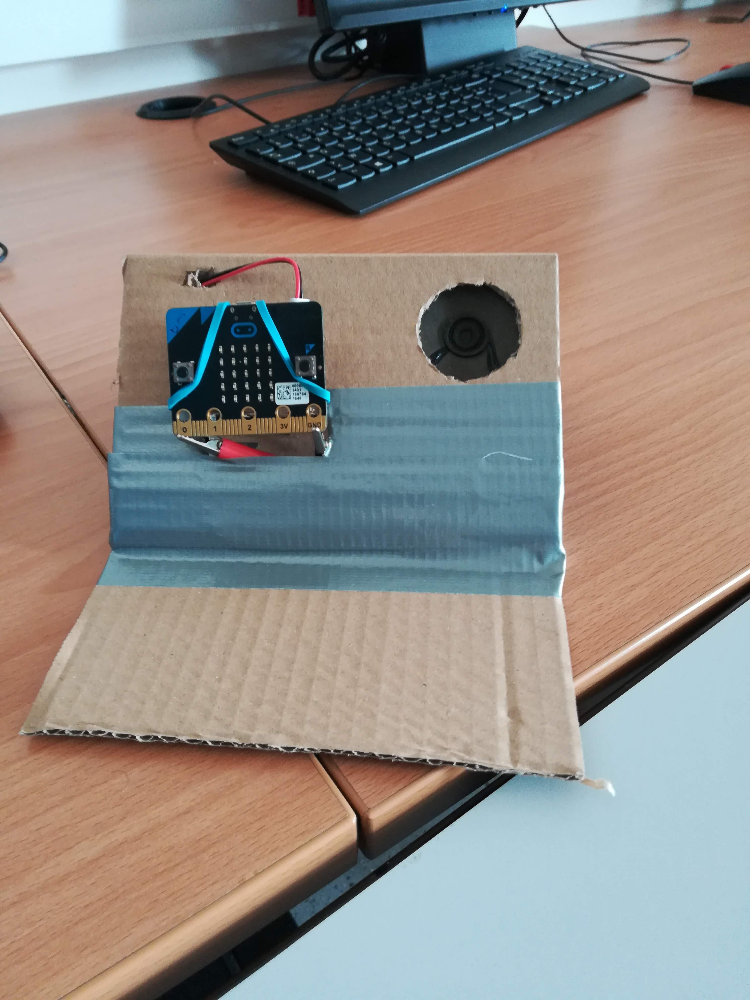

% Objets connectés
% en mathématiques, c’est possible !
% Colloque de Lyon - juin 2018

---
slideNumber: true
showNotes: false
---

# Présentations

## Animateurs d'atelier

#### Qui ?
Bruno Bourgine & Pascal Padilla

#### Quoi ?
Professeurs de Mathématiques et Sciences Physiques en Lycée Professionnel

#### Où ?
IREM Marseille

## Groupe InEFLP

Innovation

#### Formes scolaires innovantes

Expérimentation

#### Micro-contrôleur

Formation

####Algorithme

## À propos de cet atelier

#### Programmer des objets connectés pour faire des maths.

* Comprendre les objets de notre environnement.
* Des objets pour mesurer et communiquer.
* Des objets pour faire des maths.

## Déroulement de cet atelier
### (théorique)

1. Découverte du Micro:bit
2. La programmation par bloc
3. La programmation en Python

# Micro:Bit

## 

{width=65%}

<aside class="notes">
<ul>
<li>UMicro:bit est un microcontrôleur développé au Royaume-Unis.
<li>Par ses caractéristiques techniques et ses interfaces pédagogiques,
cet objet possède un fort potentiel pour l’enseignement de
l’algorithmique.
</ul>
</aside>

##

{width=40%}
{width=40%}

<aside class="notes">
<ul>
<li>Une carte à l'initiative de la BBC pour équiper
tous les collégiens anglais.
<li>Un petit objet robuste programmable par un enfant de 10 ans
<li>De grandes possibilités d'interactions avec l'environnement.
</ul>
</aside>

##

{width=45%}
{width=45%}

<aside class="notes">
La carte se programme
<ul>
<li>par bloc
<li>en Python
<li>en JavaScript
</ul>
</aside>

## {data-background-video="./res/mu.mp4" data-background-video-loop="true" data-background-size="contain"}

<aside class="notes">
La carte se programme
<ul>
<li>par bloc
<li>en Python
<li>en JavaScript
</ul>
</aside>

##

{width=55%}
{width=55%}

<aside class="notes">
entrées/sorties
<ul>
<li>bouton, broches,
<li>en radio/bluetooth
<li>en Javacompas, acceléromètre, température, luminosité
</ul>
</aside>

## Petit quizz ! 

<aside class="notes">
<a href="https://create.kahoot.it/details/atelier-lyon-quizz-1/ff6a8b84-cf7e-405d-a58a-d898a7f3ee03">
lien vers le Kahoot
</a>
</aside>

Ouvrir le lien utile **Quizz** de la page 

### [http://url.univ-irem.fr/n/](http://url.univ-irem.fr/n)

 
 
## À propos du tirage aléatoire

Discussion :

* quel intéret ?
* quelle plus-value ? 

<aside class="notes">
<ul>
<li>traitement rapide des résultats
<li>modélisation par l'élève pour tendre vers des activités plus complexes
<li>modélisation de situations complexes
</ul>
</aside>

# Programmation par blocs

## Makecode

<video loop data-autoplay src="./res/makecode.mp4" width="75%"></video>

* interface en ligne [https://makecode.microbit.org/](https://makecode.microbit.org/)
* programmation par bloc ou en javascript
* simulateur

## 

<video loop data-autoplay src="./res/makecode-tuto.mp4" width="75%"></video>

[http://url.univ-irem.fr/n/](http://url.univ-irem.fr/n)

{width=5%}

 
 

## Petit quizz ! 

<aside class="notes">
<a href="https://create.kahoot.it/details/atelier-lyon-quizz-2/a1d7fe7e-3f7e-4837-b3e1-fd77dd71f3bc">
lien vers le Kahoot
</a>
</aside>

Ouvrir le lien utile **Quizz** de la page 

### [http://url.univ-irem.fr/n/](http://url.univ-irem.fr/n)

# Programmation Python

##

{width=100%}

[http://url.univ-irem.fr/n/](http://url.univ-irem.fr/n)

{width=5%}

## Petit quizz ! 

<aside class="notes">
<a href="https://create.kahoot.it/details/atelier-colloque-lyon-quizz-3/39707329-6c08-42ec-900e-f30e772ecda5">
lien vers le Kahoot
</a>
</aside>

Ouvrir le lien utile **Quizz** de la page 

### [http://url.univ-irem.fr/n/](http://url.univ-irem.fr/n)

# Activité de recherche

## Problématique

On utilise une boucle de *n* itérations pour
allumer aléatoirement les diodes du Micro:bit.

{width=20%}

#### Combien d'itérations sont nécessaires pour allumer toutes les diodes ?

# Merci
##Groupe InEFLP

<h4>Innovation</h4>
Formes scolaires innovantes

<h4>Expérimentation</h4>
Micro-contrôleur

<h4>Formation</h4>
Algorithme

<h4> Lycée Professionnel </h4>

<aside class="notes">
<ul>
<li>colloque de Lyon<li>
<li> covoiturage</li>
</ul>
</aside>
