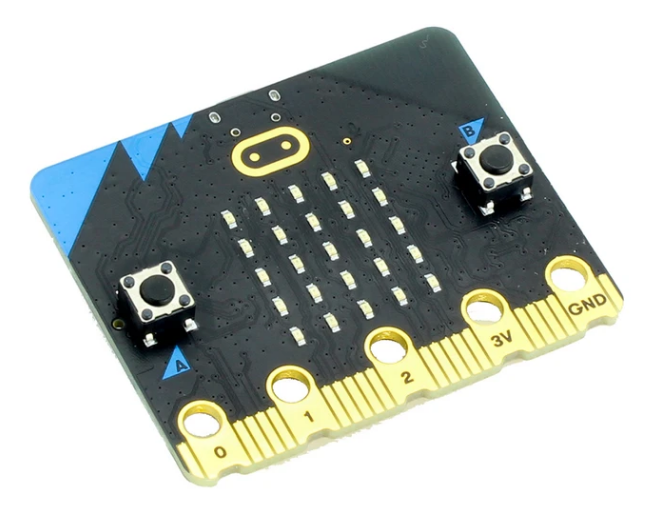
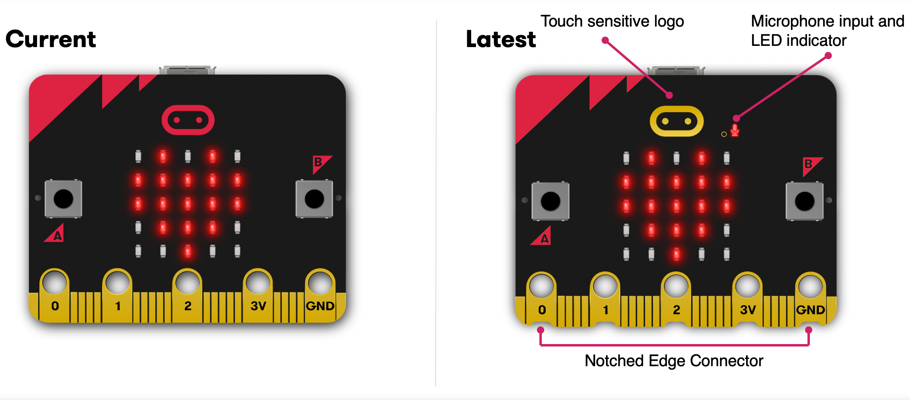
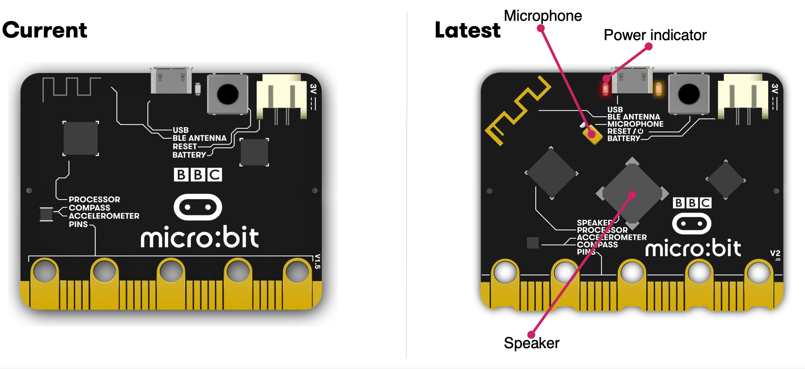
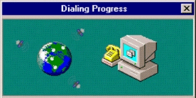

Micro:Bit 


Quels outils pour enseigner avec ?

{width=40%}

---


# Présentations

--


## Animateurs d'atelier

#### Qui ?
Bruno Bourgine

#### Quoi ?
Professeurs de Mathématiques et Sciences Physiques en Lycée Professionnel

#### Où ?
LP Mistral (Marseille 8e)

IREM : groupes enseignement de l'informatique et innovation et expérimentation en LP


---


## Déroulement de cet atelier
  
### (théorique)

1. Est-ce qu'on présente l'engin ? {.fragment .fade-down}
2. Faut-il simuler ? {.fragment .fade-down}
3. Programmer en ligne où hors ligne ? {.fragment .fade-down} 
4. Programmer avec des blocs, du python ou les deux ? {.fragment .fade-down} 
5. Gérer le travail des élèves ? {.fragment .fade-down} 

---

## Est-ce qu'on présente l'engin ?

### oui, mais succintement

--

### Les cartes disponibles

{width=60%}

{width=60%}

--

### Techniquement parlant

 * processeur : 64 MHz Arm Cortex-M4 , 512 KB flash, 128 KB RAM

 * fonctionnalités incluses : température, BLE, capteur accélération, capteur magnétique. 

 * extensions : très nombreuses (capteurs, robots)

 * code : exécuter à partir d'un fichier .HEX ou directement en microPython


--

### Les champs d'applications

 * Public : du collège aux lycées (général, technique, professionnel)

 * Disciplines : informatique, mathématiques, technologie, sciences-physiques, svt ...

--


### Pléthores ...

 * de ressources pédagogiques
 * de projets
 * d'interfaces de programmations

---

## Faut-il simuler ?


--

### Intérêts :

- pour développer, tester, corriger plus rapidement {.fragment .fade-down}
- lorsqu'il n'y a pas assez (ou pas du tout) de micro:bit à disposition{.fragment .fade-down}


### Inconvénient :

- risque de s'égarer (couper les haut-parleurs !){.fragment .fade-down}

--

### Les interfaces avec simulateurs : [Microsoft MakeCode](https://makecode.microbit.org/_8Lx6a91vma8r)

  <div style="position:relative;height:0;padding-bottom:70%;overflow:hidden;"><iframe style="position:absolute;top:0;left:0;width:100%;height:100%;" src="https://makecode.microbit.org/#pub:_8Lx6a91vma8r" frameborder="0" sandbox="allow-popups allow-forms allow-scripts allow-same-origin"></iframe></div>

--

### Les interfaces avec simulateurs : [vittascience](https://fr.vittascience.com/microbit/?link=606c5661ac7dd&mode=code)

<iframe width='100%' height='500' allowfullscreen frameborder='0' style='border:1px #d6d6d6 solid;' src="https://fr.vittascience.com/microbit/?link=606c5661ac7dd&embed=1"></iframe>

--

### Les interfaces avec simulateurs :[create with code](https://create.withcode.uk/python/E4g)

<iframe frameborder="0" width="100%" height="400px" src="https://create.withcode.uk/embed/E4g"><a target="_blank" href="https://create.withcode.uk/python/E4g">create.withcode.uk</a></iframe>

--

### Les interfaces avec simulateurs :[Visual Studio](https://marketplace.visualstudio.com/items?itemName=ms-python.devicesimulatorexpress)

Pour les téméraires : Visual Studio (MS)  + extension Device Simulator Express


---

## Programmer en ligne où hors ligne ?



--

### En ligne :


- <div style="color: lightgreen; ">rien à installer</div>
- <div style="color: lightgreen; ">les outils sont uniformes</div>
  <br/>
- <div style="color: red; ">dépendant du réseau</div>
- <div style="color: red; ">dépendant de la plateforme</div>
- <div style="color: red; ">risque accru de perte du travail</div>

<br/>
<br/>

> Les navigateur Chromium (ou Chrome) et Opéra permettent le flashage direct de la carte (protocole WebUsb).{.fragment .fade-in}

--

### Hors ligne :


- <div style="color: lightgreen; ">sûr</div>
- <div style="color: lightgreen; ">rapide</div>
  <br/>
- <div style="color: red; ">installation peut être compliqué (dépendances python)</div>
- <div style="color: red; ">gestion des mises à jour (dépendances python)</div>
<br/>
<br/>


--

### Les deux ?

Certaines interfaces sont disponibles dans les deux configurations :

 - MakeCode : application disponible pour Windows, mais se charge aussi dans le cache du navigateur (pas de simulateur hors ligne),
 - Scratch : interaction avec la carte plutôt que programmation.


---

## Programmer avec des blocs, du python ou les deux ?

Choisir en toute confiance ...


--

### Programmation en bloc 

Pour : cycle 4, CAP, transition (2nde)

* Le cas Scratch : pour interagir avec un code (parfait pour les jeux).
* MakeCode : le plus accessible et intuitif, de très nombreuses extensions.
  [fiche récapitulative des principaux blocs (pas à jour)](https://github.com/iremlp/brochure-IREM---microbit/blob/master/fiches/fiche_mb_makecode_blocsPrincipaux.tex.pdf)
* VittaScience : français, de nombreux capteurs de toutes sortes.
* Edublock : le texte des blocs reprend la syntaxe python.
* ...

**Remarque** : on peut définir de **vraies fonctions** avec MakeCode, VittaScience ou EduBlock.

--

### Programmation 100% python

Avant de programmer : [lire la doc officielle (in english)](https://microbit-micropython.readthedocs.io/fr/latest/), où bien cette [fiche IREM (in french)](https://github.com/iremlp/brochure-IREM---microbit/blob/master/fiches/fiche_mbpy-FT_python.tex.pdf).


<iframe width='80%' height='400' allowfullscreen frameborder='0' style='border:1px #d6d6d6 solid;' src="https://python.microbit.org/v/2"></iframe>

--

Son cousin, hors ligne : [Mu](https://codewith.mu/)

{width=40%}

De nombreux atouts : libre, simple, convivial, complet (REPL, fichiers, traceur, console)

---

### Programmation bloc et python


sur MakeCode, VittaScience, EduBlock

</br>
</br>

Semble idéal pour la transition ...

</br>

... à condition d'en connaître les limites.


--

#### Problème n°1 : les allers-retours

(Edublock, VittaScience)

Fonctionne très bien dans le sens BLOC -> PYTHON

Mais pas du tout dans l'autre : les modifications faites dans le script Python ne sera pas
implémenté dans le code en blocs.

 - risque de pertes de code
 - source de confusion

--

#### Problème n°2 : le faux Python

(MakeCode)

Un exemple de code classique:
```python
from microbit import *

display.scroll("Hello")
while True:
  if button_a.was_pressed():
    display.show(Image.HAPPY)
```

Le même code avec MakeCode

```python
def on_button_pressed_a():
    basic.show_icon(IconNames.HAPPY)

input.on_button_pressed(Button.A, on_button_pressed_a)

basic.show_string("Hello")
```

--

#### Problème n°2 : le faux Python

 - On ne retrouve pas les méthodes de la bibliothèque officielle. {.fragment .fade-down}
 - On n'importe pas de modules. {.fragment .fade-down}
 - On n'écrit pas de boucle 'while True' spécifique au microcontrôleur. {.fragment .fade-down}
 - On appelle beaucoup de fonctions {.fragment .fade-down}
 - On écrit du Javascript déguisé en Python.{.fragment .fade-down}

---

## Gérer le travail des élèves ?


Quelques solutions intéressantes

--

## Microbit Classroom 

[microbit classroom](https://classroom.microbit.org/)

Vous reprendrez bien une [petite fiche](https://raw.githubusercontent.com/iremlp/brochure-IREM---microbit/master/fiches/fiche_mb-classroom.tex.pdf) ?

Le mieux c'est encore d'essayer : [microbit.org/join](microbit.org/join)


--

## Microbit Classroom 

- facile à prendre en main
- pas de compte (prof ou élève) à créer
- sauvegarde du travail : bien respecter la procédure
- version bêta ... qques comportements inattendus sont possibles

--

## VittaScience Classroom

[vittascience.com/classroom](vittascience.com/classroom)

Pour tester : [https://fr.vittascience.com/classroom/login?link=gu67i](https://fr.vittascience.com/classroom/login?link=gu67i)

--

## VittaScience Classroom

 - Moins intuitif que microbit classroom
 - Nécessiter de se créer un compte
 - Pas d'interaction en direct
 - Suivi plus pointu, évaluation ?
 - Version bêta : rdv dans un mois


---

## Conclusion

 - <span style="color: lightblue">MakeCode </span> : pour découvrir, faire du bloc, partager facilement.
 - <span style="color: lightgreen">VittaScience </span> : pour la transition bloc/Python, les projets plus élaborés, créer et partatger des collections d'activités.
 - <span style="color: purple">Mu </span> : pour faire du Python

Quelques fiches ressources : [github.com/iremlp/brochure-IREM---microbit](https://github.com/iremlp/brochure-IREM---microbit)

